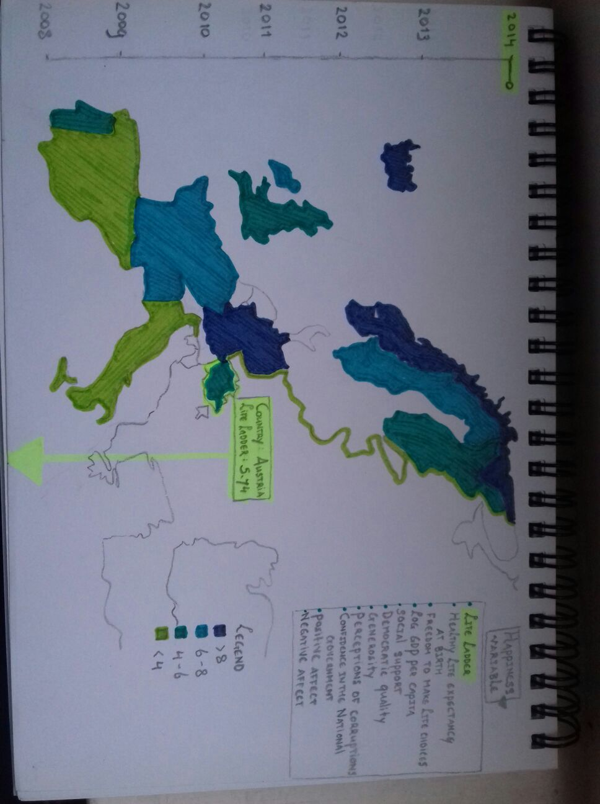
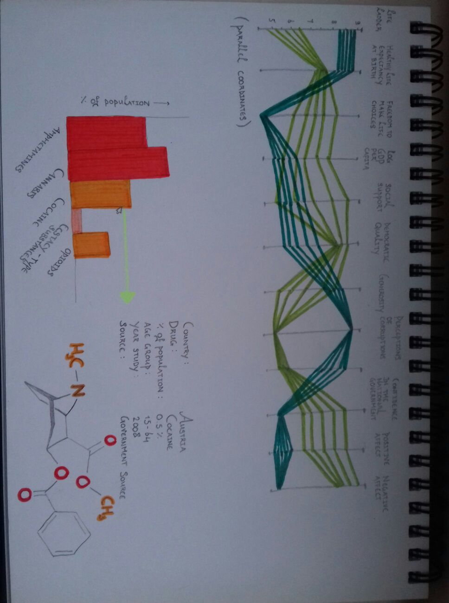

### Design
By Thirza Dado – 10492682
##### Map of Europe
A map of Europe will be created by zooming in on the d3 World Map. Information over the time course 2008-2014 can be viewed by means of a slider. In total, eleven windows can be chosen in which another variable will be displayed by color code. For this matter, it is important to implement a convenient dictionary with country codes pointing to the years, and years pointing to the rest of the variables. *See image 1.*
##### Graph of parallel coordinates
In this graph, the user can play with all eleven variables of multiple countries. *See image 2.*
##### Bar graph
When clicking on a country, a bar chart appears with the annual prevalence of drug use of five types of drugs (x axis) as percentage of the population between 15-64 years old (unless otherwise indicated) (y axis): prevalence of amphetamines, cannabis, cocaine, ecstasy-type substances, and opiates (also includes problem opiate users). *See image 2.* 
##### Table
When a bar in the bar graph gets clicked on, a values get filled in in an (empty) table. *See image 2.*
##### Scatterplot
Optional.

*Dataset 1 Happiness variables:*
1. Healthy life expectancy at birth
2. Positive affect
3. Generosity
4. Country
5. Perceptions of corruption
6. Democratic Quality
7. Freedom to make life choices
8. Life Ladder
9. Confidence in national government
10. Year
11. Log GDP per capita
12. Social support
13. Negative affect

*Dataset 2 Drugs variabeles:*
1. Amphetamines in EU countries
2. Cannabis in EU countries
3. Cocaine in EU countries
4. Ecstacy-like drugs in EU countries
5. Opiates in EU countries

